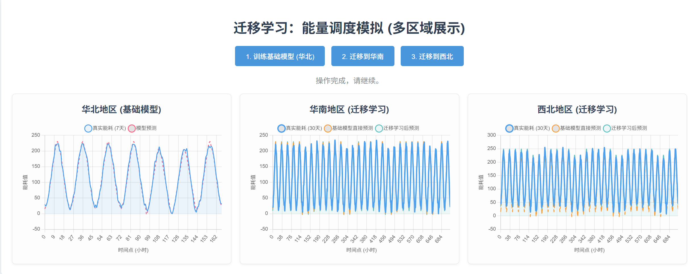

```markdown
# 能源需求预测迁移学习演示

这是一个基于 Flask 的 Web 应用，用于演示**迁移学习**（Transfer Learning）在能源需求预测中的应用。

## 概述

该应用模拟了三个不同地区的能源消耗模式：
*   **华北地区 (Source Region):** 作为源领域，拥有大量历史数据，用于训练一个基础模型。
*   **华南地区 (Target Region 1):** 作为目标领域，数据模式与源领域不同，且数据量较少。
*   **西北地区 (Target Region 2):** 作为另一个目标领域，具有独特的数据模式和少量数据。

核心思想是：通过在数据丰富的“华北地区”上训练一个基础模型，然后利用迁移学习技术，将该模型的知识迁移到数据稀疏的“华南”和“西北”地区，以加速其模型的训练并提升预测性能。

## 技术栈

*   **后端:** Python, Flask
*   **机器学习:** TensorFlow/Keras, Scikit-learn
*   **前端:** HTML, CSS, JavaScript (使用 Chart.js 进行可视化)
*   **核心算法:** 迁移学习 (通过 `clone_model` 和 `set_weights` 实现)

## 功能

1.  **训练基础模型:** 用户可以首先为“华北地区”训练一个基础的神经网络模型。
2.  **应用迁移学习:** 在基础模型训练完成后，用户可以选择“华南”或“西北”地区，应用迁移学习。
3.  **结果可视化:** 应用会以图表形式展示：
    *   基础模型在源领域的预测结果。
    *   迁移模型在目标领域的预测结果。
    *   基础模型在目标领域上的直接预测结果（作为对比）。

## 文件结构

*   `app.py`: Flask 后端主程序，包含模型构建、数据生成和 Web 路由。
*   `templates/`:
    *   `index.html`: 主页面，包含用户界面和 Chart.js 图表。
*   `static/`:
    *   `style.css`: 页面样式。
    *   `script.js`: 前端 JavaScript 逻辑，负责与后端交互和图表更新。

## 如何运行

1.  **安装依赖:**
    ```bash
    pip install flask tensorflow scikit-learn numpy
    ```

2.  **启动服务器:**
    在项目根目录下运行：
    ```bash
    python app.py
    ```

3.  **访问应用:**
    打开浏览器，访问 `http://127.0.0.1:5000`。

## 使用说明

1.  启动应用后，首先点击“训练华北地区模型”按钮。
2.  等待训练完成，图表将显示华北地区的实际需求与预测需求。
3.  然后，选择“华南地区”或“西北地区”，点击“应用迁移学习”按钮。
4.  图表将更新，展示迁移学习在所选地区的应用效果，包括迁移模型的预测、基础模型的直接预测和实际需求。

## 注意

*   为了演示的可重复性，代码中设置了固定的随机种子 (`np.random.seed(42)`)。
*   本项目主要用于教学和演示目的，数据为模拟生成。
```
